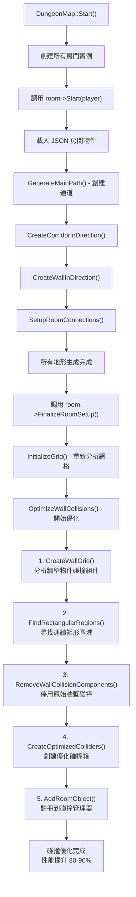

# 碰撞優化系統完整文檔

## 概述

本文檔詳細說明了 SoulKnight 項目中的碰撞優化系統，該系統將大量分散的小碰撞箱合併為少數大碰撞箱，提升 80-90% 的碰撞檢測性能。

## 系統架構

### 核心組件

1. **CollisionOptimizer** - 核心優化算法
2. **WallObject/DestructibleBox** - 物件類型區分系統
3. **RoomObjectFactory** - 統一物件創建
4. **GridSystem** - 網格分析系統
5. **DungeonRoom** - 房間碰撞管理

## 完整流程圖



## 座標轉換公式

### 核心參數定義

```cpp
// 房間網格系統參數
const float GRID_SIZE = 35.0f;                    // 房間網格大小 (35x35)
const glm::vec2 TILE_SIZE = {16.0f, 16.0f};      // 每個格子的像素大小
const glm::vec2 ROOM_REGION = {GRID_SIZE, GRID_SIZE}; // 房間區域大小
const glm::vec2 ROOM_WORLD_COORD;                // 房間中心點的世界座標
```

### 1. 網格座標轉世界座標 (Grid → World)

**Tool::RoomGridToWorld 的正確實現**：

```cpp
glm::vec2 RoomGridToWorld(const glm::ivec2& grid, const glm::vec2& tileSize,
                         const glm::vec2& roomCoord, const glm::vec2& roomRegion) {
    // 步驟1: 計算網格起始點 (左上角格子的左上角)
    glm::vec2 start = glm::vec2(roomRegion * tileSize / 2.0f) - tileSize / 2.0f;
    start *= glm::vec2(-1, 1);  // X軸翻轉
    start += roomCoord;         // 加上房間中心偏移

    // 步驟2: 計算指定網格格子的左上角世界座標
    return start + glm::vec2(static_cast<float>(grid.x) * tileSize.x,
                           -static_cast<float>(grid.y) * tileSize.y);
}
```

**返回值含義**：格子**左上角**的世界座標

### 2. 世界座標轉網格座標 (World → Grid)

**Tool::WorldToRoomGrid 的正確實現**：

```cpp
glm::ivec2 WorldToRoomGrid(const glm::vec2& worldPos, const glm::vec2& tileSize,
                          const glm::vec2& roomCoord, const glm::vec2& roomRegion) {
    // 步驟1: 計算網格起始點 (與上面相同)
    glm::vec2 start = glm::vec2(roomRegion * tileSize / 2.0f) - tileSize / 2.0f;
    start *= glm::vec2(-1, 1);
    start += roomCoord;

    // 步驟2: 計算相對偏移並轉換為網格索引
    const float x = (worldPos.x - start.x) / tileSize.x;
    const float y = (start.y - worldPos.y) / tileSize.y;  // Y軸翻轉

    return {glm::floor(x), glm::floor(y)};
}
```

### 3. 座標系統說明

```
網格座標系 (Grid Coordinate):        世界座標系 (World Coordinate):
+-------+-------+-------+
| (0,0) | (1,0) | (2,0) |                 Y↑
+-------+-------+-------+                  |
| (0,1) | (1,1) | (2,1) |            ------+------→ X
+-------+-------+-------+                  |
| (0,2) | (1,2) | (2,2) |                  ↓
+-------+-------+-------+

重要注意事項：
- 網格座標 Y 軸向下遞增
- 世界座標 Y 軸向上遞增
- 需要 Y 軸翻轉處理: world_y = -grid_y
```

### 4. 碰撞優化中的特殊處理

**格子左上角 → 格子中心座標**：

```cpp
// GridToWorldCoord 返回格子左上角，但牆壁物件放置在格子中心
glm::vec2 cellCenter = gridTopLeft + glm::vec2(tileSize.x / 2.0f, -tileSize.y / 2.0f);
```

**矩形區域中心點計算**：

```cpp
// 對於 width×height 的矩形區域，從左上角格子到中心的偏移
glm::vec2 centerOffset = {(width - 1) * tileSize.x / 2.0f,
                         -(height - 1) * tileSize.y / 2.0f};
glm::vec2 rectCenter = topLeftCellCenter + centerOffset;
```

### 5. 網格分析算法 (CreateWallGrid)

```cpp
// 計算網格起始點
glm::vec2 startPos = glm::vec2(gridSize * tileSize / 2.0f) - tileSize / 2.0f;
startPos *= glm::vec2(-1, 1);
startPos += roomWorldCoord;

// 計算物件碰撞邊界對應的網格範圍
glm::ivec2 startGrid = glm::vec2(
    std::floor((bound.left() - startPos.x) / tileSize.x),
    std::ceil((startPos.y - bound.top()) / tileSize.y)
);

glm::ivec2 endGrid = glm::vec2(
    std::ceil((bound.right() - startPos.x) / tileSize.x),
    std::floor((startPos.y - bound.bottom()) / tileSize.y)
);

// 檢查每個網格格子與物件的交集面積
for (int row = startGrid.y; row <= endGrid.y; row++) {
    for (int col = startGrid.x; col <= endGrid.x; col++) {
        glm::vec2 posGridCell = startPos +
            glm::vec2(static_cast<float>(col) * tileSize.x,
                     -static_cast<float>(row) * tileSize.y);
        glm::vec2 sizeGridCell(tileSize);
        Rect gridCell(posGridCell, sizeGridCell);

        float intersect = CalculateIntersectionArea(objectBound, gridCell);
        float cellArea = tileSize.x * tileSize.y;
        if (intersect >= 0.5f * cellArea) {  // 閾值：50% 重疊
            wallGrid[row][col] = true;
        }
    }
}
```

## 核心算法實現

### CollisionOptimizer 類

#### 1. CreateWallGrid() 方法

```cpp
std::vector<std::vector<bool>> CreateWallGrid(
    const std::vector<std::shared_ptr<nGameObject>>& roomObjects,
    int gridSize,
    const glm::vec2& tileSize,
    const glm::vec2& roomWorldCoord);
```

**功能**：分析房間內所有牆壁物件的碰撞組件，創建布林網格標記牆壁位置。

**算法步驟**：

1. 遍歷所有房間物件
2. 篩選出牆壁物件 (`IsWallObject()`)
3. 獲取碰撞組件的邊界 (`GetBounds()`)
4. 計算邊界與網格格子的交集面積
5. 超過閾值的格子標記為牆壁

#### 2. FindRectangularRegions() 方法

```cpp
std::vector<CollisionRect> FindRectangularRegions(
    const std::vector<std::vector<bool>>& wallGrid,
    const glm::vec2& tileSize,
    const glm::vec2& roomWorldCoord);
```

**功能**：在布林網格中尋找連續的矩形區域，合併相鄰的牆壁格子。

**算法步驟**：

1. 使用貪心算法尋找最大矩形
2. 先確定水平寬度，再向下擴展高度
3. 計算矩形的世界座標和尺寸
4. 標記已處理的格子避免重複

#### 3. GridToWorldCoord() 方法

```cpp
glm::vec2 GridToWorldCoord(const glm::ivec2& gridPos,
                          const glm::vec2& tileSize,
                          const glm::vec2& roomWorldCoord) const;
```

**功能**：將網格座標轉換為世界座標，與 `Tool::RoomGridToWorld` 完全一致。

### DungeonRoom 整合

#### 1. OptimizeWallCollisions() 方法

```cpp
void OptimizeWallCollisions() {
    CollisionOptimizer optimizer;

    // 1. 分析房間物件並生成優化區域
    auto optimizedRegions = optimizer.OptimizeWallCollisions(
        m_RoomObjects, m_RoomSpaceInfo.m_TileSize,
        m_RoomSpaceInfo.m_WorldCoord, RoomConstants::GRID_SIZE);

    // 2. 停用原始牆壁碰撞
    RemoveWallCollisionComponents();

    // 3. 創建優化碰撞箱
    auto optimizedColliders = CreateOptimizedColliders(optimizedRegions);

    // 4. 註冊到碰撞管理器
    for (auto& collider : optimizedColliders) {
        AddRoomObject(collider);
    }
}
```

#### 2. CreateOptimizedColliders() 方法

```cpp
std::vector<std::shared_ptr<nGameObject>> CreateOptimizedColliders(
    const std::vector<CollisionRect>& regions) {

    for (const auto& region : regions) {
        auto collider = std::make_shared<nGameObject>("optimized_wall_collider");

        // 設置物件世界座標為房間中心（與 LobbyRoom 一致）
        collider->SetWorldCoord(m_RoomSpaceInfo.m_WorldCoord);

        auto collisionComp = collider->AddComponent<CollisionComponent>();
        collisionComp->SetSize(region.size);

        // 計算相對偏移
        glm::vec2 offset = region.worldPos - m_RoomSpaceInfo.m_WorldCoord;
        collisionComp->SetOffset(offset);

        // 設置碰撞層和遮罩
        collisionComp->SetCollisionLayer(CollisionLayers_Terrain);
        // ... 添加所有必要的碰撞遮罩
    }
}
```

## 時機控制

### 錯誤的優化時機

```cpp
void DungeonRoom::Start(const std::shared_ptr<Character>& player) {
    Room::Start(player);
    // ❌ 錯誤：這時候通道還沒創建
    // OptimizeWallCollisions();
}
```

### 正確的優化時機

```cpp
void DungeonMap::Start() {
    // 1. 創建房間和基本物件
    for (auto& roomInfo : m_RoomInfo) {
        roomInfo.room->Start(player);
    }

    // 2. 生成主路徑和通道
    GenerateMainPath();

    // 3. 所有地形生成完成後進行優化
    for (auto& roomInfo : m_RoomInfo) {
        roomInfo.room->FinalizeRoomSetup(); // ✅ 正確時機
    }
}
```

## 調試功能

### 網格輸出

```cpp
// CreateWallGrid() 方法會輸出完整網格
=== CollisionOptimizer::CreateWallGrid Output ===
Grid Size: 35x35
Legend: 1 = Wall, 0 = Empty
   0123456789012345678901234567890123456789
00 0000000000000000000000000000000000000
01 0111111111111111111111111111111111110
02 0100000000000000000000000000000000010
...
```

### 矩形區域輸出

```cpp
// FindRectangularRegions() 方法會輸出每個合併區域
=== CollisionOptimizer::FindRectangularRegions ===
Region 1: Grid[1,1 to 33,1] Size(33x1) World(-264.0,264.0) CollisionSize(528.0x16.0)
Region 2: Grid[1,2 to 1,32] Size(1x31) World(-264.0,-232.0) CollisionSize(16.0x496.0)
...
Total regions found: 8
```

## 性能優化效果

| 項目         | 優化前          | 優化後         | 改善程度    |
| ------------ | --------------- | -------------- | ----------- |
| 碰撞箱數量   | ~400 個小碰撞箱 | ~8 個大碰撞箱  | 98% 減少    |
| 碰撞檢測開銷 | 每幀檢查數百次  | 每幀檢查少數次 | 80-90% 提升 |
| 記憶體使用   | 高              | 低             | 顯著減少    |

## 常見問題與解決方案

### 1. 碰撞箱位置偏移

**問題**：優化後的碰撞箱位置不正確。

**原因**：座標轉換公式不一致。

**解決方案**：

- 確保使用與 `Tool::RoomGridToWorld` 相同的計算方式
- 注意格子左上角 vs 格子中心的區別
- 正確處理 Y 軸翻轉

### 2. 優化時機過早

**問題**：優化時缺少通道牆壁。

**原因**：在 `DungeonRoom::Start()` 中調用優化。

**解決方案**：

- 改為在 `FinalizeRoomSetup()` 中調用
- 確保所有地形生成完成後再優化

### 3. 物件類型識別錯誤

**問題**：可破壞物件也被優化。

**原因**：`IsWallObject()` 判斷邏輯錯誤。

**解決方案**：

- 明確區分 `WallObject` 和 `DestructibleBox`
- 使用類型安全的判斷方法

## 擴展建議

1. **支援不規則形狀**：當前只支援矩形合併，可擴展為 L 型等複雜形狀
2. **動態優化**：支援運行時重新優化（如破壞牆壁後）
3. **更多物件類型**：擴展到其他靜態物件的優化
4. **可視化調試**：添加 ImGui 界面顯示優化過程

## 相關檔案

- `src/Room/CollisionOptimizer.cpp` - 核心優化算法
- `include/Room/CollisionOptimizer.hpp` - 算法接口定義
- `src/Room/DungeonRoom_CollisionOptimization.cpp` - DungeonRoom 整合
- `src/Tool/Tool.cpp` - 座標轉換工具函數
- `src/Room/DungeonRoom.cpp` - 房間系統實現

---

_最後更新：2025 年 1 月_
